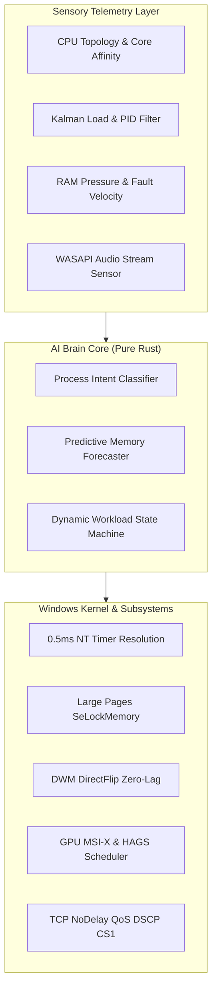

<div align="center">

# ⚡ Smart System Manager (`ssm`)

### **Autonomous AI-Driven Windows Subsystem & Kernel Performance Engine**
*100% Native Rust · Zero-Overhead Background Daemon · Sub-Millisecond Latency*

<br/>

[](https://www.rust-lang.org/)
[-0078D6.svg?style=flat-square&logo=windows)](https://www.microsoft.com/windows)
[](LICENSE)
[](https://github.com/thisath111/ssm/actions)
[](https://github.com/thisath111/ssm)

<br/>

[Quick Install](#-1-line-quick-installation) • [Key Innovations](#-core-innovations) • [Architecture](#-architecture) • [CLI Manual](#-cli-command-reference) • [Building](#-building-from-source)

</div>

---

## ⚡ 1-Line Quick Installation

Run this single command in an **Administrator PowerShell** to automatically install `ssm`, configure PATH, and start the native Windows background daemon:

```powershell
irm https://raw.githubusercontent.com/thisath111/ssm/main/install.ps1 | iex
```

> **Zero Maintenance:** `ssm` registers as an autonomous Windows Service (SCM) with boot autostart. It runs silently in the background using less than **0.01% CPU** and **~6 MB RAM**.

---

## 🌟 Core Innovations

### 🧠 1. Pure-Rust Microsecond AI Engine
- **Process Intent Classifier:** Sub-microsecond heuristic classifier categorizes active applications into **Gaming**, **Creative Workstation (Video/3D)**, **Software Development**, or **Productivity/Background**, adapting system resources in real time.
- **Predictive Standby Memory Forecaster:** Tracks the first-derivative momentum ($\frac{dM}{dt}$) of RAM usage to predict memory pressure spikes **5 seconds in advance**. Standby cache is purged *pre-emptively* before game stutter or page fault stalls occur.
- **Dynamic Workload State Machine:** Continuously balances system operating modes (`UltraGaming`, `CreatorDeveloperBoost`, `StandardInteractive`, `PowerSaverIdle`) via real-time sensory feedback.

### ⚡ 2. Sub-Millisecond Kernel Scheduler & DWM DirectFlip
- **0.5ms Win32 Timer Resolution:** Invokes undocumented NT APIs (`NtSetTimerResolution(5000)`) to lock system timer resolution to 0.5ms for immediate mouse/keyboard responsiveness.
- **DirectFlip Zero-Lag Presentation:** Strips Desktop Window Manager (DWM) composition animation delays (`MinAnimate = 0`) and enforces direct hardware overlay scan-out.
- **Dynamic App Launch Accelerator:** Detects newly spawned processes and grants temporary `HIGH_PRIORITY_CLASS` boosts for 3 seconds for instant app responsiveness.

### 🚀 3. Deep Memory & Storage Acceleration
- **Kernel Large Pages (2MB/4MB HugePages):** Grants `SeLockMemoryPrivilege` to enable Hardware Large Pages, drastically cutting Translation Lookaside Buffer (TLB) cache misses for compilers, databases, and modern games.
- **Zero-Copy Standby Memory Purge:** Flushes unreferenced standby lists using undocumented NT memory management calls without touching active working sets.
- **DirectStorage & NVMe Queue Depth Tuning:** Optimizes NTFS MFT cache allocation and maximizes NVMe I/O parallel request queues.

### 🛡️ 4. Anti-Hang Shield & Zero-Crash OS Guard
- **Explorer Auto-Rescue:** Monitors Windows Explorer message queues via `IsHungAppWindow`. If a damaged USB drive or I/O deadlock freezes the taskbar, `ssm` gracefully restarts it within seconds.
- **Network Burst Throttling:** Detects and throttles notorious background telemetry and update services (`TiWorker.exe`, `compattelrunner.exe`, `wermgr.exe`, `mrt.exe`) to `IDLE_PRIORITY_CLASS`—completely eliminating the "internet-on" PC freeze.
- **Core Immunity Matrix:** Hardcoded immunity shields ensure critical Windows subsystems (`csrss.exe`, `lsass.exe`, `dwm.exe`, `winlogon.exe`) can never be throttled or misallocated.

---

## 🏛️ Architecture



---

## 💻 CLI Command Reference

```powershell
# Display real-time telemetry, AI active app intent & hardware topology
ssm stats

# Execute instant multi-tier hardware boost (CPU Unparking, 0.5ms Timer, Large Pages, DWM DirectFlip)
ssm boost

# Purge Windows Standby RAM memory & clean temporary storage files
ssm clean

# Apply low-latency system registry tweaks (MSI-X Interrupts, Fast Shutdown, TCP NoDelay)
ssm tune

# Run standalone foreground daemon loop
ssm daemon

# Register or unregister Windows Background Service (SCM)
ssm service install
ssm service uninstall

# Complete clean uninstallation (reverts tweaks, cleans PATH, removes service)
ssm uninstall

# Display help and version information
ssm --help
```

---

## 📊 Live Telemetry Preview (`ssm stats`)

```text
==================================================
  Smart System Manager · Live System Status
==================================================
  Logical CPU Cores           : 16
  P-Core Mask                 : 0x00000000000000ff
  E-Core Mask                 : 0x000000000000ff00
  Timer Resolution            : 0.50 ms (Min: 15.62 ms, Max: 0.50 ms)
  RAM Usage                   : 48.2% (Free: 16840 MB / Total: 32678 MB)
  RAM Pressure Level          : Nominal
  Disk Usage (C:)             : 62.4% (Free: 184.2 GB / Total: 490.0 GB)
  Autostart on Boot           : Enabled (Windows SCM Service)
  Kalman Estimated Load       : 12.4%
  Kernel Large Pages (TLB)    : 2 MB (Hardware Supported)
  Active App Intent (AI)      : Code.exe [Developer / Compilation]
==================================================
```

---

## 🛠️ Building from Source

### Prerequisites
- [Rust 2021 Edition](https://www.rust-lang.org/tools/install) (1.75 or later)
- Windows 10 / 11 (64-bit)

### Compilation

```powershell
git clone https://github.com/thisath111/ssm.git
cd ssm
cargo build --release
```

The optimized release binary will be available at `./target/release/ssm.exe`.

### Running Unit Tests

```powershell
cargo test -- --nocapture
```

---

## 📄 License

Distributed under the **MIT License**. See [`LICENSE`](LICENSE) for details.
